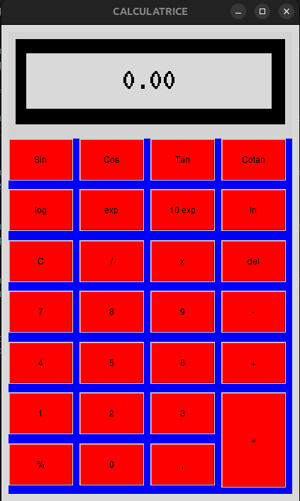

Calculator Project

A simple calculator developed in [Python]. This project implements basic operations such as addition, subtraction, multiplication, and division, as well as advanced features (sine, cosine, tangent, logarithm, exponential, etc.) depending on the requirements.
Features

    Addition
    Subtraction
    Multiplication
    Division
    Logarithm
    Exponential
    Sine
    Cosine
    Tangent
    Cotangent
    Power of 10

Prerequisites

    [Python, Tkinter]
    ## Technologies Used

This project was developed using:

- Python

bash

pip install tkinter

Installation

    Clone the project from GitHub:

bash

git clone https://github.com/Ferdinaelectro/Calculatrice_python.git

    Navigate to the project directory:

bash

cd Calculatrice_python

Usage

    Run the main calculator file (main.py):

bash

python main.py

    To perform an operation, click on the buttons according to the calculation to be performed, then press equal (=) to validate.
    Note: Currently, you can only use one operator at a time.
    Example:
        Allowed: 3 + 5 + 6
        Not allowed: 3 + 4 x 5

Screenshot

Contributing

Contributions are welcome! Please follow these steps to contribute:

    Fork the project.
    Create a new branch: git checkout -b feature/your-feature.
    Make your changes and commit: git commit -m 'Add your feature'.
    Push to the branch: git push origin feature/your-feature.
    Open a Pull Request.

License

This project is licensed under the MIT License. See the LICENSE file for more details.
